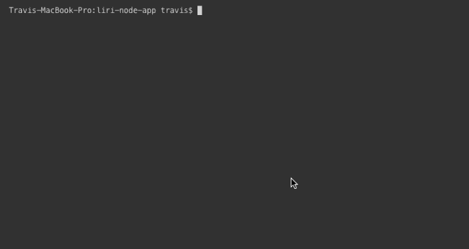

# LIRI CLI App

> Homework assignment: University of Richmond Full Stack Boot Camp

## Overview

LIRI is a Language Interpretation and Recognition Interface. LIRI is a command line Node.js app that takes in parameters and returns data.

LIRI has four functions. Three of them take in a user's input, whereas the fourth function is more random and pulls its function parameters from a specified txt file.

The three user-input functions are `concert-this`, `spotify-this-song`, and `movie-this`. The fourth (random function) is `do-what-it-says`.

## Tools Used

LIRI is a CLI app using the following languages, tools, and libraries:

- JavaScript
- Node.js
- BandsInTown API
- Spotify Node API
- OMDB API

## Screenshots and GIFs

### Concert-This

The format for this command:
`node liri concert-this <insert band/artist name>`

This will return a list of concert dates, sourced from the BandsInTown API, based on the user argument provided. It returns in a format that displays the artist, venue, location, and event date.

Example:

### Spotify-This-Song

The format for this command:
`node liri spotify-this-song <insert song title>`

This will return a list of songs based on the user argument. This command utilizes the node-spotify-api package. It returns in a format that displays the artist, song, Spotify link, and the album.

Example:

If no user argument is given, the command defaults to `spotify-this-song` for the song, "The Sign" by Ace of Base, as seen below:

### Movie-This

The format for this command:
`node liri movie-this <insert movie title>`

Utilizing the OMDB API, this command returns information about a movie. The returned info contains the title, release year, IMDB rating, Rotten Tomatoes rating, production countries, language, plot, and cast.

Example:

If no user argument is given, the command defaults to `movie-this` for the movie, _Mr. Nobody_, as seen below:

### Do-What-It-Says

The format for this command:
`node liri do-what-it-says`

This command returns a random result of one of the commands above, based on the contents of the `random.txt` file. By default, it will run the `spotify-this-song` command for the song `"I Want It That Way"`

Example:

### Commands are Logged to log.txt

Every time the user inputs a command, the input and output are logged to `log.txt`

## Deployment

LIRI is a command line interface app and therefore cannot be deployed. It runs locally in a machine's command line.